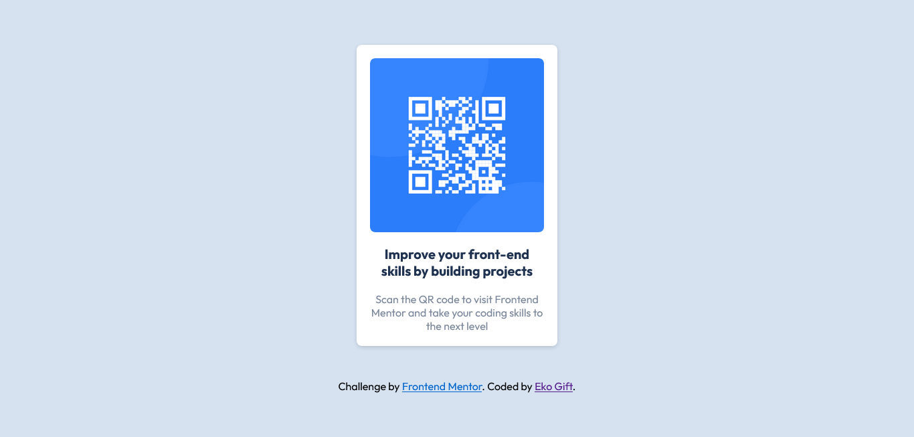

# Frontend Mentor - Product preview card component solution

This is a solution to the [Product preview card component challenge on Frontend Mentor](https://www.frontendmentor.io/challenges/product-preview-card-component-GO7UmttRfa). Frontend Mentor challenges help you improve your coding skills by building realistic projects. 

## Table of contents

- [Overview](#overview)
  - [Screenshot](#screenshot)
  - [Links](#links)
- [My process](#my-process)
  - [Built with](#built-with)
  - [What I learned](#what-i-learned)
- [Author](#author)

## Overview

### Screenshot

### Links

- Solution URL: [https://github.com/Eko-U/product-card.git](https://github.com/Eko-U/qr-code)
- Live Site URL: [https://eko-u.github.io/product-card/](https://eko-u.github.io/qr-code/)

### Built with

- Semantic HTML5 markup
- CSS custom properties
- Flexbox

### What I learned
I have been able to reinforce my knowledge on flexbox.

## Author

- Frontend Mentor - [@Eko-U](https://www.frontendmentor.io/profile/Eko-U)
- Twitter - [@eko_gift](https://www.twitter.com/eko_gift)